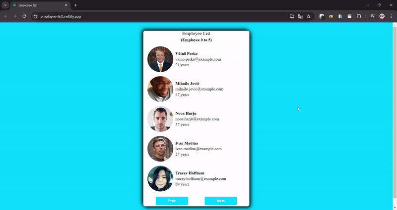

<h1>Employee List<h1>



[👉click here to employee list](https://employee-listt.netlify.app/)

<h2>Project Skeleton</h2>

```
Employee List  (folder)
  |          
  |---public (folder)
  |---src (folder)      
  |     |  
  |     |---helper (folder)
  |     |     └---data.js   
  |     |  
  |     |---components (folder)
  |     |     |---List.css
  |     |     └---List.jsx    
  |     |         
  |     |
  |     |---App.js
  |     |---Index.js
  |     └---Index.css
  |         
  |----package.json
  |----yarn.lock
  └----readme.md 
```